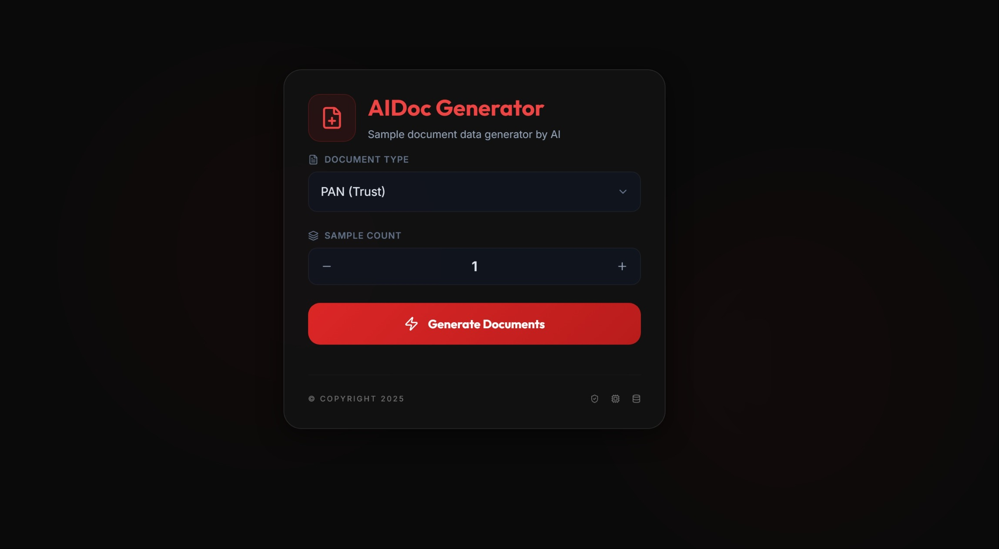

# AI Document Generator



A powerful, web-based AI-powered document generator built with **TypeScript** and **Express**. Dynamically generate realistic sample data for various document types using OpenAI's GPT-4, with a robust fallback mechanism and a sleek, modern UI.

Check the source code on GitHub: [GitHub Repo](https://github.com/kiranbalaji71/generate-sample.git)

---

## 🚀 Features

- **🤖 AI-Powered Data Generation**: Leverages OpenAI GPT-4 to generate authentic and diverse sample data.
- **🛡️ Robust Fallback Mode**: Automatically switches to high-quality hardcoded data if AI is not configured or fails.
- **🔥 Multiple Document Types**:
  - **Identity & Legal**: PAN (Trust / Company), Birth Certificate, Rental Agreement.
  - **Billing**: Gas Bill, Electricity Bill.
  - **Corporate**: Employment Offer Letter, Purchase Order, Goods Receipt Note (GRN), Salary Slip.
  - **Automotive**: Vehicle Registration Certificate (RC).
- **📊 Real-time Progress**: Visual progress bar tracking the generation status.
- **📦 Batch Generation**: Specify any number of samples and download them instantly as a ZIP file.
- **💎 Premium UI**: Modern dark theme designed with Tailwind CSS, featuring glassmorphism and Lucide icons.

---

## 🛠️ Installation

1. **Clone the repository**:

   ```bash
   git clone https://github.com/kiranbalaji71/generate-sample.git
   cd generate-sample
   ```

2. **Install dependencies**:

   ```bash
   npm install
   # or
   yarn install
   ```

3. **Configure AI (Optional but Highly Recommended)**:
   Create a `.env` file in the root directory and add your OpenAI API key:

   ```env
   OPENAI_API_KEY=sk-your-actual-openai-api-key-here
   AI_MODEL=gpt-4o-mini
   ```

   > [!TIP]
   > Configure your API key to experience the full power of realistic, AI-generated data.

4. **Run the server**:
   ```bash
   npm run dev
   # or
   yarn run dev
   ```
   The application will be available at [http://localhost:8000](http://localhost:8000).

---

## 📂 Project Structure

```
.
├── public/                      # Frontend assets (HTML, Tailwind CSS, JS)
├── src/
│   ├── index.ts                 # Express server entry point
│   ├── lib/
│   │   └── ai.ts                # Vercel AI SDK & OpenAI configuration
│   ├── generate/                # Specialized document generation modules
│   ├── fonts/                   # Custom fonts for document rendering
│   ├── templates/               # Image templates for documents
│   ├── types/                   # TypeScript interfaces and types
│   └── helper/                  # Utility functions (e.g., ZIP compression)
├── docs/                        # Documentation assets (Screenshots, etc.)
├── .env.example                 # Environment variable template
└── package.json                 # Project dependencies and scripts
```

---

## 🔌 API Reference

### `GET /options`

Returns the list of available document types for the frontend dropdown.

### `POST /generate`

Generates the requested documents.

- **Body**: `{ "type": "document_type", "sample": number }`
- **Returns**: A ZIP file containing the generated PNG/PDF documents.

---

## 🧪 AI Configuration Details

This project uses the **Vercel AI SDK** with OpenAI.

- **Efficiency**: Employs batch generation to minimize API calls and latency.
- **Validation**: Uses **Zod** schemas to ensure the AI-generated data strictly adheres to the required document formats.
- **Cost**: Optimized with `gpt-4o-mini` for a perfect balance of intelligence and cost-efficiency.

---

## 🎨 Technology Stack

- **Backend**: Node.js, Express, TypeScript
- **AI**: Vercel AI SDK, OpenAI API, Zod
- **Rendering**: Canvas API (for images), PDFKit (for PDFs)
- **Frontend**: HTML5, Tailwind CSS, Lucide Icons
- **Bundling**: TypeScript Compiler (TSC), TSX

---

## 📄 License

This project is licensed under the [MIT License](LICENSE).

---

**Built with ❤️ by [Kiran Balaji](https://github.com/kiranbalaji71)**
